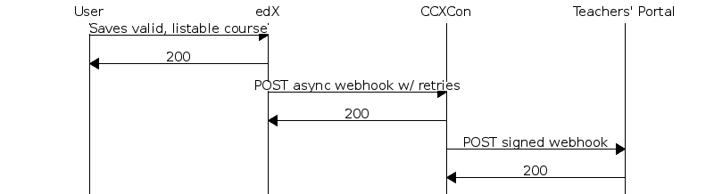
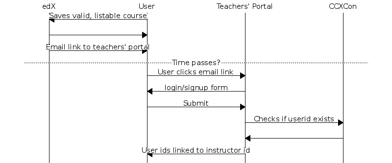
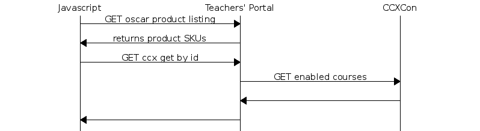

teachersportal
--------

Teacher's Portal

.. image:: https://travis-ci.com/mitodl/teachersportal.svg?token=XTpdxUNyGRQG4uuk8RkK
    :target: https://travis-ci.com/mitodl/teachersportal

.. image:: https://www.herokucdn.com/deploy/button.png
    :target: https://heroku.com/deploy


Getting Started
===============

You can either run this locally with a default sqlite database after
installing the requirements.txt file, or if you have Docker and
prefer a cleaner environment, install docker-compose with ``pip
install docker-compose`` and run ``docker-compose up``. This will set
up
a near production-ready containerized development environment that
runs migrations, with the django development server running on
port 8075.

To run one-off commands, like shell, you can run
``docker-compose run web python manage.py shell`` or to create root
user, etc.

For OS X development
====================

**docker-osx-dev keeps host FS changes synced to the docker machine**

Install docker-osx-dev before starting.

You can do that by typing `make` after you set up your docker
container for the first time.

Subsequently, before you start up your docker container with
docker-compose up, you would run: docker-osx-dev -m default -s ./
(if your docker VM is called `default`, and your CWD is the
root of the teachers portal source directory).

**docker machine setup**

1. Configuration setup

Copy the `.env.sample` file to `.env` and edit these values:

```
CCXCON_API="<url of your ccxcon instance>"
CCXCON_OAUTH_CLIENT_ID="<client id of your ccxcon oauth application>"
CCXCON_OAUTH_CLIENT_SECRET="<client secret of your ccxcon oauth application>"
```

2. Create your docker machine

- `docker-machine create default`
- `docker-machine start default`
- `docker-machine env default`
- `eval "$(docker-machine env default)"`

3. Create a user
- run: `docker-compose run web python manage.py createsuperuser`, to create a user who has permission to view the course.

4. Start the machine
- `docker-compose up`
- visit: http://192.168.99.100:8075/

> **NB: your IP may vary depending on what docker assigns to your VM; if the IP above doesn't work:
> - power down your docker-machine (`docker-machine stop default`)
> - `docker-machine ssh default`
> - once in the docker machine shell, run `ifconfig`, and look for the IP that begins with 192.168.99.xxx

- click the login button on the TP UI and put in those credentials.
- browse ccxcon-ci, and choose a course uuid, you can view that course in teachersportal: https://url.of.your.ccxcon/api/v1/coursexs/
- Now visit: http://192.168.99.100:8075/courses/asdf-asdf-asdf-asdf (or whatever the uuid is that you selected).


Dev Tools
=========

`react-devtools <https://github.com/gaearon/redux-devtools>` is in use
on this repository. This will help you debug actions and mutations to
the underlying redux store. To enable it, press `Ctrl+H`. You can then
click the action names to undo or redo them.


Adding an application
=====================

To add an application to this, add it to the requirements file, add
its needed settings, include its URLs, and provide any needed template
overrides.


Testing
=======

The project is set up with
`tox<https://tox.readthedocs.org/en/latest/>`_ and
`py.test<http://pytest.org/latest/>`_. It will run pylint, pep8, and
py.test tests with coverage. It will also generate an HTML coverage
report. To run them all inside the docker image, run ``docker-compose
run web tox``, or if you are running locally, after installing the
requirements file, just run ``tox``.

Continuous Testing
~~~~~~~~~~~~~~~~~~

If you want test to run on file changes, the ``test_requirements.txt``
adds pytest-watcher, which can be started with ``ptw``. This
unfortunately will not work well in the Docker container because the
file events it uses are fired on the host OS, and not the docker OS. I
have corrected it upstream with
`issue<https://github.com/joeyespo/pytest-watch/issues/9>`_ to the
`pytest-watch repo<https://github.com/joeyespo/pytest-watch>`_, but it
has not been released to pypi as of this writing.


How it works
============

This describes how the full system works with regards to edX and the
Teachers' Portal (listed as TP for the rest of this document). The
system is designed to work with multiple edX backends and multiple
clients beyond TP, but this should provide a reasonable sense for how
things work at a high level.

Initial App Setup
-----------------

We need to generate users and keys for all clients of ccxcon. This is
done in the django admin. We pass those credentials to edX and TP who
will use them for making requests.

Getting the course to Teachers' Portal
--------------------------------------

When the user lists a course as enabled for CCX and inputs a CCXcon
advanced setting, the course is exportable to ccxcon.

Any publishes of this course will post updates to CCXCon
asynchronously, using the credentials given to edX initially.

Upon receipt, CCXCon will make its own async post to any number of
backends (e.g. TP).

From this point, the course is in the TP database. Its users can
toggle its visibility after setting prices.



Login Flow
----------

When a CCX is marked as "enabled for CCX", we generate an anonymous
user id for each admin user of the course. This gets sent along with
the create payload to CCXCon. Additionally, we generate an email with
a login link to TP for the user.

When the user clicks the link, they're taken to a login/register page
on TP. Upon successful login/creation, TP queries CCXCon for which
course this belongs to. If it finds a user, the account is linked on
the TP side. All subsequent API requests are filtered by these
credentials as necessary. CCXCon does *NOT* handle authorization
checks.



Course Listings
---------------

When doing a public course listing, the javascript frontend queries TP
for available courses (as determined by the django-oscar Product
model). This returns ids to look up. From here, the javascript
dispatches an additional API call to CCXCon to get detail on those
specific course ids for populating the UI.

In the instructor dashboard case (privileged, unpublished course
listing), we validate they're a course owner on TP, then issue a fetch
for their known course ids (using the mapping table we've generated on
TP from them clicking the login links edX emailed them) on CCXCon.



Order Fulfillment on Teachers' Portal
-------------------------------------

Order fulfillment will result in a user with a ccx on edx (or some
similar backend instance) with a limited set of seats.

Upon checking out and paying for the course, TP issues an RPC to
CCXCon to create a ccx for a particular user with a particular seat
count. This synchronously posts the command to edX and handles the
creation.

Q: How do we know which user it is? Enrollments?

Updating previous order
-----------------------

Users can purchase additional seats, so it's important that TP keep
track of seat count purchases.

If the teacher has bought a course and views it again, the buy slider
is already selected to the seat count they've purchased. It can't go
lower than that number. If they drag it to buy more seats and
purchase, we make a synchronous patch to edx via ccxcon to update this
seat count listing.
